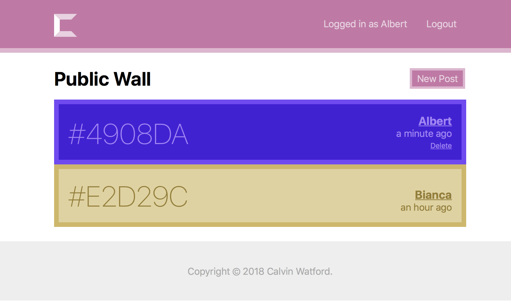

# Colial
Color + Social = Colial. A social platform where status updates are *just* colors.

This was a small project I did for one of my courses to demonstrate competency of PHP. Thus, this
project is definitely feature-incomplete. My hopes are that this project can later inspire me or
someone else, or as a learning resource.

The development of this project was an avenue for learning myself, in that I was able to expiriment
with technologies I had been watching for a while, but never had a good use case.

> See the [frontend readme](./frontend/README.md) for a few more screenshots.

## Backend
The backend is a custom REST-like API structure written in PHP.

For more information, see the [backend readme](./backend/README.md).

## Frontend
The frontend is a React application written almost completely in JavaScript (with React/JSX and
modern JavaScript extensions, via Babel).

For more information, see the [frontend readme](./frontend/README.md).

# Going Forward
If I am to revisit this project in the future, there are a few different ideas I feel are worth
considering to make this project better:

* Using an actual PHP framework, i.e. [Laravel](https://laravel.com)
* Writing the frontend in a different framework, i.e. [Angular](https://angular.io)
* Put in place a linter to keep code consistently formatted
* A more thought-out design
* Adding more features (of course)

# Running
## 0. Prerequisites
To run Colial, you must have any kind of setup that includes:

* A relatively new version of [PHP](https://php.net/)
* A running [MySQL](https://www.mysql.com/) server
* The [PDO extension](https://php.net/manual/en/book.pdo.php) w/ the MySQL PDO driver
* The [`mod_rewrite` Apache module](https://httpd.apache.org/docs/current/mod/mod_rewrite.html)

> This setup can be easily achieved using [XAMPP](https://www.apachefriends.org/).

Also, to bundle the frontend, you must have:

* a recent version of [Node.js](https://nodejs.org/) (v6+)

## 1. Building the Frontend

    $ cd frontend/
    $ npm install
    $ npm run build

And that's all there is to it! The `build` npm script just calls webpack on the project.

Output files will be in the `dist/` directory in `frontend/`.

## 2. Copy Files to Your Server
Copy every file in:

* `backend/`
* `frontend/dist/`

to your server. With XAMPP, this would be the `htdocs` directory.

## 3. Setup the Database
A description of the (notably small) database structure can be found in
[`backend/internal/doc/databse.md`](./backend/internal/doc/database.md). I appologize for not
providing a simpler method of recreating the databse, i.e. a `.sql` file. The MySQL databse should
be named `colial`.

## 4. Run Your Server
Make sure Apache and MySQL are running, and you should be good to go! Simply access your server
(`http://localhost/`) and you should see the application running.
