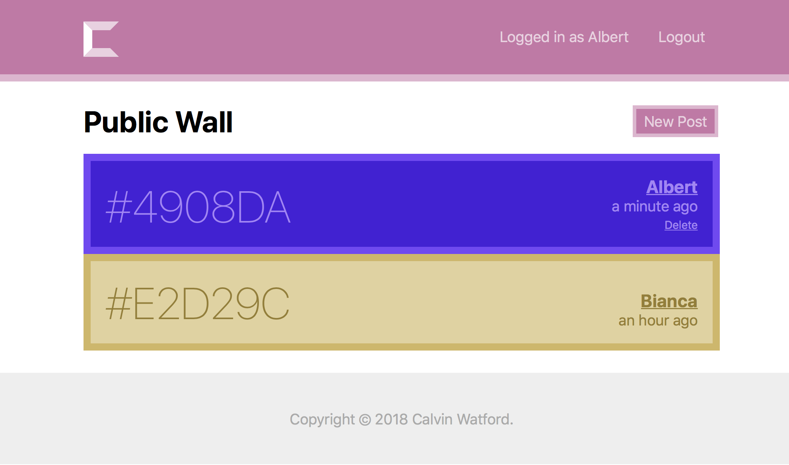

# Colial Frontend
Colial's frontend has been written using a multitude of JavaScript technologies:

* [React](https://reactjs.org): a view framework
  * [React Router](https://reacttraining.com/react-router/web/guides/philosophy): a routing
    framework for React
  * [Redux](https://redux.js.org): a state framework for React
    * [Rematch](https://github.com/rematch/rematch): a framework to reduce Redux boilerplate
  * [Emotion](https://emotion.sh): a
    [CSS-in-JS](https://hackernoon.com/all-you-need-to-know-about-css-in-js-984a72d48ebc) solution
* [webpack](https://webpack.js.org): a JavaScript bundler (transpiles code and assets)
* [Babel](https://babeljs.io): a JavaScript transpiles ("compiles" JavaScript)

In general, the frontend can be summarized as a React web application. More specifically, the
styling of the application is handled by Emotion, and application state is handled using Redux
(made simpler using Rematch).

> **Note:** This project was built to be used in modern versions of Chrome and Safari. As such,
  other browsers are untested and may render incorrectly.

## Screenshots

> *Note:* Screenshots generated using random input colors.

## Project Structure
* `dist/`: This directory is generated after webpack is used to bundle the source. Houses the
  generated JavaScript bundles and `index.html` page.
* `src/`
  * `components/`: A plethora of individual design components.
  * `pages/`: Full pages.
  * `misc/`: Utility functions.
    * `API.js`: A mapping of backend API methods to frontend functions, with a method of injecting
      sample responses during development.
    * `FaviconGenerator.js`: A hardcoded method of generating the site's favicon.
    * `models.js`: Houses all the Rematch models.
    * `util.js`: Mostly methods to standardize color changes, but also any general utility function.
  * `index.html`: A *template* that defines the general structure of the generated `index.html`.
  * `main.jsx`: The main entrypoint for the application; the first JavaScript that runs on the page.
  * `App.jsx`: The main React component that handles seting up the application, i.e. the Redux
    datastore, routing, and global styles.
* `jsconfig.json`: A file similar to
  [`tsconfig.json`](http://www.typescriptlang.org/docs/handbook/tsconfig-json.html) used by
  [VS Code](https://code.visualstudio.com) when linting JavaScript.

## Common Code Patterns

### `connect(mapState, mapDispatch)`
This is the function that connects a React component to the Redux datastore. This allows that
component to:

* access data stored in the datastore (access the state); and
* dispatch actions that mutate the datastore (change the state)

### `<Element css={...} />`
This is an extension to React's JSX syntax, made by [Emotion](https://emotion.sh/docs/babel), that
allows for inline CSS. At compile time (when bundling with `webpack`), the `css` prop is compiled
using Emotion, and the generated class name is substituted in place of the `css` prop.
